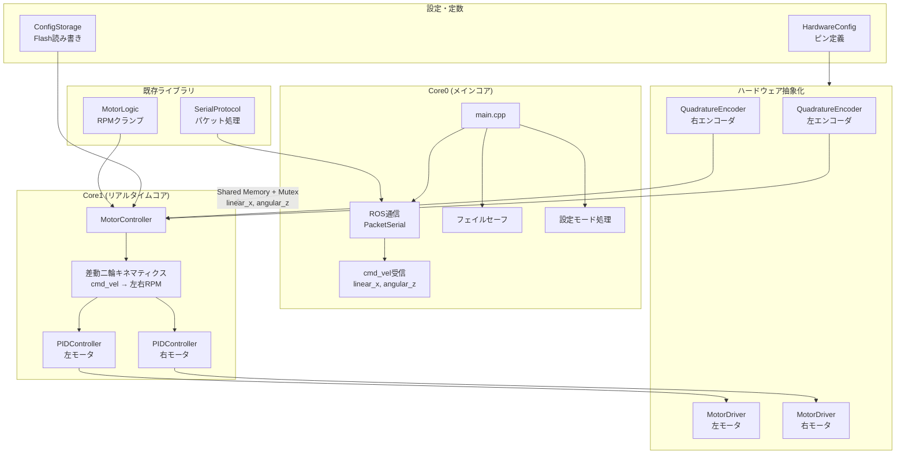
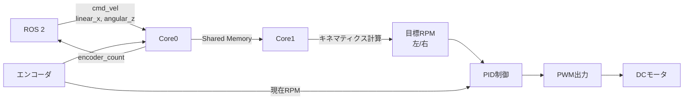
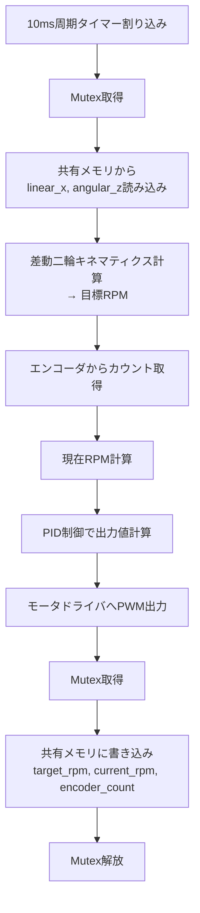
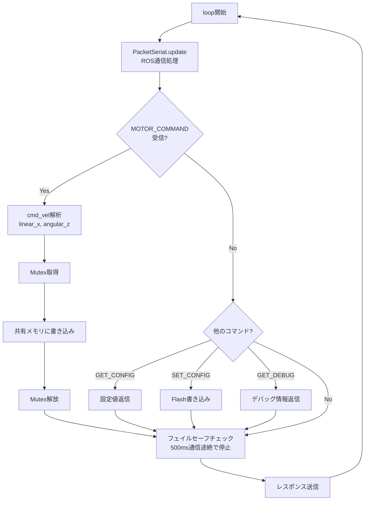

# アーキテクチャ設計

DCモータ差動二輪ロボット汎用コントローラの設計ドキュメント。

## 概要

このプロジェクトはCuGo専用ファームウェアから汎用DCモータ差動二輪ロボット向けに拡張中。

### 現状（CuGo専用）→ 新仕様（汎用）の変更点

| 機能 | 現状（CuGo） | 新仕様（汎用） |
|------|-------------|---------------|
| エンコーダ取得 | LD-2からSerial1受信 | **Picoピン入力で2相エンコーダ直読** |
| 速度制御 | LD-2任せ | **Pico内でPID制御** |
| モータ出力 | RPMをSerial1送信 | **PWM + 方向ピン(H/L)** |
| ROS通信 | PacketSerial | 変更なし |
| RC/CMDモード | LD-2依存 | 削除（将来別途実装） |
| タイマー | main.cppの自作実装 | **ハードウェアタイマー割り込み** |
| 設定変更 | コード書き換え | **設定ツールでFlash書き込み** |

## デュアルコア構成

Raspberry Pi Picoのデュアルコアを活用してリアルタイム性を確保。

### Core0（メインコア）
- ROS通信（PacketSerial）
- コマンド解析・cmd_vel受信（linear_x, angular_z）
- フェイルセーフ監視
- 設定モード処理
- エンコーダカウントをROSに送信

### Core1（リアルタイムコア）
- エンコーダ割り込み処理
- PID制御ループ（高周期実行）
- モータPWM出力

### コア間通信（Shared Memory + Mutex）

共有メモリとMutexによるデータ共有。最新値を常に参照可能。

```cpp
#include "pico/mutex.h"

// 共有データ構造
struct SharedMotorData {
    // Core0 → Core1（cmd_vel入力）
    float linear_x;       // 並進速度 [m/s]
    float angular_z;      // 回転速度 [rad/s]
    bool failsafe_stop;

    // Core1 → Core0（現在値）
    long encoder_count_l;
    long encoder_count_r;
    float target_rpm_l;   // cmd_velから計算した目標RPM
    float target_rpm_r;
    float current_rpm_l;  // エンコーダから計算した現在RPM
    float current_rpm_r;
};

volatile SharedMotorData shared_data;
mutex_t motor_mutex;

// Core0での書き込み（ROSから受信したcmd_vel）
mutex_enter_blocking(&motor_mutex);
shared_data.linear_x = new_linear_x;
shared_data.angular_z = new_angular_z;
mutex_exit(&motor_mutex);

// Core1での読み込み（キネマティクス計算してRPMに変換）
mutex_enter_blocking(&motor_mutex);
float linear_x = shared_data.linear_x;
float angular_z = shared_data.angular_z;
mutex_exit(&motor_mutex);
// → MotorController内でRPM計算
```

## 新アーキテクチャ



### データフロー



## ライブラリ一覧

### 既存ライブラリ（変更なし）

| ライブラリ | 役割 | テスト |
|-----------|------|-------|
| SerialProtocol | ROS通信プロトコル | ○ |
| MotorLogic | RPMクランプ | ○ |

### 新規ライブラリ

| ライブラリ | 役割 | テスト | 実行コア |
|-----------|------|-------|---------|
| PIDController | PID制御演算 | ○ | Core1 |
| QuadratureEncoder | 2相エンコーダ読み取り | △（ロジック部のみ） | Core1 |
| MotorDriver | PWM+方向出力 | × | Core1 |
| MotorController | モータ制御統合 | △（ロジック部のみ） | Core1 |
| ConfigStorage | Flash設定保存 | × | Core0 |
| HardwareConfig | ピン・パラメータ設定 | × | 両方 |

### 削除予定

| ライブラリ | 理由 |
|-----------|------|
| CugoSDK | LD-2専用のため汎用版では不要 |

## 設定保存・変更方式

### 設定項目

| 項目 | 型 | デフォルト値 | 備考 |
|------|---|-------------|------|
| PID Kp | float | 1.0 | |
| PID Ki | float | 0.1 | |
| PID Kd | float | 0.01 | |
| 最高速度 (RPM) | float | 200.0 | |
| エンコーダPPR | uint16_t | 1024 | |
| 減速比 | float | 1.0 | モータ軸→ホイール軸 |
| ホイール直径 | float | 0.1 | [m] |
| トレッド幅 | float | 0.3 | [m] 左右ホイール間距離 |

### 設定変更方式

ROS側から `SET_CONFIG` リクエスト（0x04）を送信することで設定をFlashに保存する。
専用の設定ツールは不要で、ROS 2パッケージから直接設定変更が可能。

#### 動作フロー

1. ROS側から `SET_CONFIG` リクエスト送信
2. Picoが設定値を受信・検証
3. `EEPROM`または`LittleFS`でFlashに永続化
4. 結果をレスポンスで返信（成功/失敗）

詳細は `documents/protocol.md` の `0x04: SET_CONFIG` を参照。

## 新規ライブラリ詳細設計

### PIDController

PID制御の演算ロジック。ハードウェア非依存でユニットテスト可能。

```cpp
class PIDController {
public:
    PIDController(float kp, float ki, float kd);

    void setGains(float kp, float ki, float kd);
    void setOutputLimits(float min, float max);
    void reset();

    float compute(float setpoint, float measured, float dt);

private:
    float kp_, ki_, kd_;
    float integral_;
    float prev_error_;
    float output_min_, output_max_;
};
```

### QuadratureEncoder

2相エンコーダ（A/B相）からパルスカウントとRPMを取得。

```cpp
class QuadratureEncoder {
public:
    QuadratureEncoder(uint8_t pin_a, uint8_t pin_b, uint16_t ppr);

    void begin();                    // 割り込み設定
    long getCount();                 // 累積カウント取得
    void resetCount();               // カウントリセット
    float getRPM(float dt);          // RPM計算

private:
    uint8_t pin_a_, pin_b_;
    uint16_t ppr_;                   // Pulses Per Revolution
    volatile long count_;
    long prev_count_;

    static void handleInterrupt();   // 割り込みハンドラ
};
```

### MotorDriver

汎用DCモータドライバ（方向+PWM方式）への出力。

```cpp
class MotorDriver {
public:
    MotorDriver(uint8_t pin_dir, uint8_t pin_pwm);

    void begin();
    void setSpeed(float speed);      // -1.0 ~ 1.0（負で逆転）
    void stop();
    void brake();                    // 急停止（ドライバ対応時）

private:
    uint8_t pin_dir_, pin_pwm_;
};
```

### MotorController

左右モータの統合制御。PID制御ループを内包。Core1で実行。
cmd_velから差動二輪キネマティクスでRPMを計算する機能を持つ。

```cpp
class MotorController {
public:
    MotorController(
        QuadratureEncoder& encoder_l, QuadratureEncoder& encoder_r,
        MotorDriver& driver_l, MotorDriver& driver_r,
        PIDController& pid_l, PIDController& pid_r
    );

    void begin();

    // cmd_velからRPMを計算して設定
    void setCmdVel(float linear_x, float angular_z);

    // ロボットパラメータ設定（ConfigStorageから読み込み）
    void setRobotParams(float wheel_diameter, float track_width, float gear_ratio);

    void update(float dt);           // 制御ループ（定期呼び出し）

    float getTargetRPM_L();          // cmd_velから計算した目標RPM
    float getTargetRPM_R();
    float getCurrentRPM_L();         // エンコーダから計算した現在RPM
    float getCurrentRPM_R();
    long getEncoderCount_L();
    long getEncoderCount_R();

private:
    // 差動二輪キネマティクス計算
    void calculateWheelRPM(float linear_x, float angular_z,
                           float& left_rpm, float& right_rpm);

    float wheel_diameter_;
    float track_width_;
    float gear_ratio_;
    float target_rpm_l_, target_rpm_r_;
    // 各コンポーネントへの参照
};
```

**キネマティクス計算:**
```cpp
void MotorController::calculateWheelRPM(float linear_x, float angular_z,
                                         float& left_rpm, float& right_rpm) {
    float wheel_radius = wheel_diameter_ / 2.0f;

    // 左右ホイールの速度 [m/s]
    float left_vel  = linear_x - angular_z * track_width_ / 2.0f;
    float right_vel = linear_x + angular_z * track_width_ / 2.0f;

    // ホイール回転数 [rad/s] → モータRPM
    // RPM = (vel / (2*PI*r)) * 60 * gear_ratio
    float rad_to_rpm = 60.0f / (2.0f * PI * wheel_radius) * gear_ratio_;
    left_rpm  = left_vel * rad_to_rpm;
    right_rpm = right_vel * rad_to_rpm;
}
```

### ConfigStorage

Flashへの設定保存。

```cpp
struct RobotConfig {
    float pid_kp;
    float pid_ki;
    float pid_kd;
    float max_rpm;
    uint16_t encoder_ppr;
    float gear_ratio;        // 減速比
    float wheel_diameter;    // ホイール直径 [m]
    float track_width;       // トレッド幅 [m]
    uint8_t checksum;        // 設定有効性確認用
};

class ConfigStorage {
public:
    void begin();
    bool load(RobotConfig& config);
    void save(const RobotConfig& config);
    void resetToDefaults();

private:
    static const RobotConfig DEFAULT_CONFIG;
};
```

### HardwareConfig

ハードウェア設定の一元管理。

```cpp
// HardwareConfig.h
namespace HardwareConfig {
    // エンコーダピン
    constexpr uint8_t ENCODER_L_A = 2;
    constexpr uint8_t ENCODER_L_B = 3;
    constexpr uint8_t ENCODER_R_A = 4;
    constexpr uint8_t ENCODER_R_B = 5;

    // モータドライバピン
    constexpr uint8_t MOTOR_L_DIR = 6;
    constexpr uint8_t MOTOR_L_PWM = 7;
    constexpr uint8_t MOTOR_R_DIR = 8;
    constexpr uint8_t MOTOR_R_PWM = 9;

    // PWM設定
    constexpr uint32_t PWM_FREQUENCY = 20000;  // 20kHz

    // 制御周期
    constexpr uint32_t CONTROL_PERIOD_US = 10000;  // 10ms (100Hz)
}
```

## 制御ループ

### Core1（リアルタイム処理）



### Core0（通信処理）



## 実装順序

1. **HardwareConfig** - ピン定義
2. **PIDController** - ハードウェア非依存、テスト作成
3. **QuadratureEncoder** - エンコーダ読み取り
4. **MotorDriver** - PWM出力
5. **MotorController** - 統合（Core1実行）
6. **ConfigStorage** - Flash設定保存
7. **main.cpp改修** - デュアルコア構成、CugoSDK削除

## Raspberry Pi Pico固有API（PlatformIO/Arduino）

使用するarduino-picoコアのAPI:

| 機能 | API |
|------|-----|
| デュアルコア | `setup1()` / `loop1()` |
| Mutex | `#include "pico/mutex.h"` / `mutex_init()` / `mutex_enter_blocking()` / `mutex_exit()` |
| タイマー割り込み | `add_repeating_timer_us()` (pico-sdk) |
| GPIO割り込み | `attachInterrupt()` |
| PWM | `analogWriteFreq()` + `analogWrite()` |
| Flash保存 | `EEPROM` または `LittleFS` |
